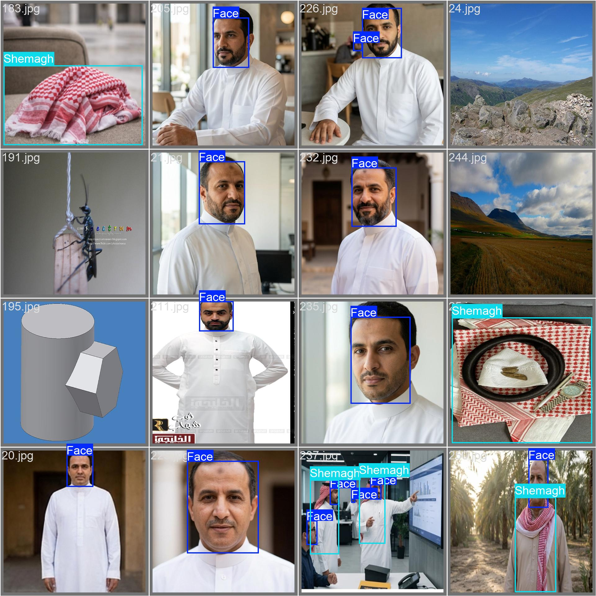
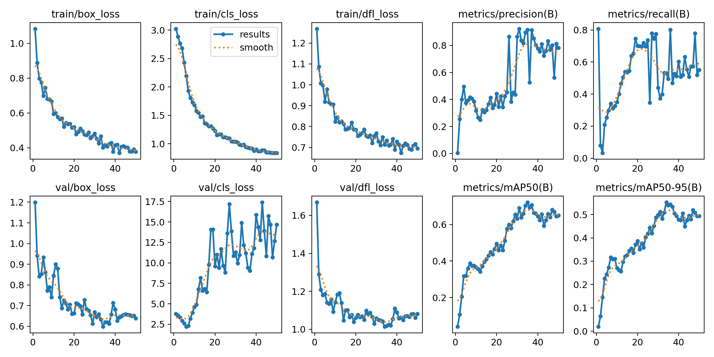

# 🇸🇦 Shemagh Detection & Placement

A state-of-the-art hybrid computer vision pipeline designed to determine whether a traditional Saudi Shemagh is worn correctly on a person's head or if the image contains random elements (e.g., street views, misaligned clothing, or face-only crops).
---

## 🚀 Key System Features

* **Hybrid Two-Stage Pipeline:** Combines real-time object detection (**YOLO11m**) with high-fidelity vision transformers (**ConvNeXt Tiny**).
* **Test-Time Augmentation (TTA) & WBF:** Uses multi-scale inputs merged via **Weighted Boxes Fusion (WBF)** for pixel-perfect localization.
* **Automated Pseudo-Labeling Pipeline:** Generates high-confidence automated training annotations on the test dataset to combat domain shift.
* **Geometric Feature Heuristics:** Evaluates head-to-shemagh symmetry, intersection ratios, vertical bounds, and center displacements.
* **Class-Wise Non-Maximum Suppression (NMS):** Ensures zero-duplicate bounding boxes on heavily overlapping landmarks.

---
### 👁️ Model Detection Examples


---
## 🛠️ Hybrid Architecture Workflow

```text
[Input Image]
  │
  ▼
┌──────────────┐
│   YOLO11m    │ ───► Detects Spatial Coordinates for Face & Shemagh
└──────────────┘
  │
  ▼
┌──────────────┐
│  Geometric   │ ───► Calculates Symmetry, Offsets & Intersection over Head (IoH)
│   Analyzer   │
└──────────────┘
  │
  ▼
┌──────────────┐
│   ConvNeXt   │ ───► Final Classification Check (True/Correct vs False/Incorrect)
└──────────────┘
  │
  ▼
[Final Submission File]
```

---

## 📊 Dataset & Competition Source

The official dataset for training and testing is hosted directly on the Kaggle competition page. You can access and download the full dataset from the following link:

* **Official Dataset:** [Kaggle Competition Data Challenge Page 🌐](https://www.kaggle.com/competitions/dal-shemagh-detection-challenge/data)

---

## 📦 Heavy Model Weights & Checkpoints

Due to GitHub's file size limitations (max 100MB per file), the heavy trained model checkpoints directory `shemagh_convnext_models` could not be uploaded directly. It is securely hosted on Google Drive:

* **Trained Directory:** `shemagh_convnext_models`
* **Direct Download Link:** [Download Model Weights from Google Drive 🚀](https://google.com)

> **Note:** After downloading, extract and place the `shemagh_convnext_models` folder directly into the root directory of this project so the script can detect the paths automatically.

---

## 💻 Local Installation & Setup

### 1. Clone the Project Repository
```bash
git clone https://github.com
cd dal-shemagh-detection
```

### 2. Configure Your Environment Variables
Open the python script and modify the absolute local path directories inside `SystemConfig` block to point to your laptop dataset location:
```python
class SystemConfig:
    BASE_DATA_DIR = Path('.')
    TRAIN_IMG_DIR = Path(r'C:\Your\Local\Path\images\train')
    TEST_IMG_DIR = Path(r'C:\Your\Local\Path\images\test')
    TRAIN_CSV = Path(r'C:\Your\Local\Path\train_labels.csv')
```

### 3. Install All Dependencies
Run the following execution line inside your terminal terminal framework to establish all packages:
```bash
pip install torch torchvision torchaudio --index-url https://pytorch.org
pip install ultralytics timm pandas scikit-learn tqdm opencv-python ensemble-boxes matplotlib pyyaml
```
*(Note: If you run it locally on CPU without dedicated Nvidia hardware drivers, replace the first line with basic `pip install torch torchvision torchaudio`)*

---

## ⚙️ Model Training Configurations

| Hyperparameter | Configuration Value | Target Stage |
| :--- | :--- | :--- |
| **YOLO Base Model** | `yolo11n.pt` | Object Detection |
| **YOLO Image Size** | `640` | Training Resolution |
| **YOLO Epochs** | `50` | Full Run Iterations |
| **ConvNeXt Model** | `convnext_tiny.fb_in22k_ft_in1k` | Classification Backbone |
| **ConvNeXt Image Size**| `224` | Input Dimensions |
| **Cross-Validation** | `5-Fold Stratified` | Class Balancing Strategy |

---

### 📈 Model Training Results & Metrics


---
## 🏃 Run the Complete Execution Pipeline

To launch the automated end-to-end processing pipeline—which includes training, geometric filtering, pseudo-label creation, vision transformer refinement, and output tracking—simply execute the main module file:
```bash
python shemagh_detection.py
```

### Generated Submissions Output
Once the tracking completion loops end, the finalized formatted target predictions array will be automatically generated and exported as a challenge submission asset locally:
* **Output Path:** `./final_submission.csv`

---

## 📄 License
This project is prepared and optimized exclusively for the **Dal Shemagh Detection Challenge**. Distributed under the MIT License.
